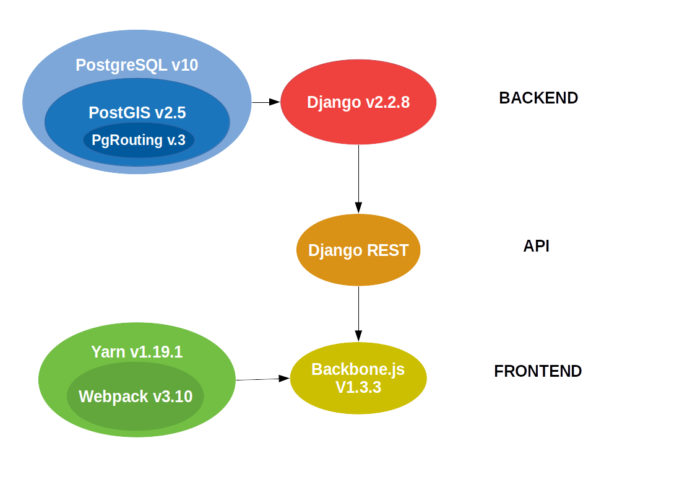

# geoflux
New implementation of geoFluxus website

## Local Installation
### Clone repo
If you have Git or any other related software ([GitHub Desktop](https://desktop.github.com/), [GitKraken](https://www.gitkraken.com/) etc.), clone the repo in your computer with the command:

```(git clone) https://github.com/VasileiosBouzas/geoflux.git```

### Backend 
Make sure that [Python3](https://www.python.org/downloads/) is installed in your computer. To check that, open a terminal and insert the command:

```python --version```

If the command is recognized, the currentrly installed version of Python should appear in your screen. Once you have verified that Python3 is properly installed, enter the following command to download the necessary dependencies:

```pip3 install -r requirements.txt```

(If you wish to set up a Python virtual environment instead, please check the instructions [here](https://docs.python.org/3/tutorial/venv.html)).

**ATTENTION!**: Backend depends upon certain geodata libraries for which some extra steps are necessary to configure them in different operating systems (for more info, please visit this [page](https://docs.djangoproject.com/en/3.0/ref/contrib/gis/install/).

- Windows: To assure that you have all the necessary supporting files for the geodata libraries, please install [OSGEO4W](https://trac.osgeo.org/osgeo4w/) in your **C:** drive.

- macOS: To assure that you have all the necessary supporting files for the geodata libraries, please use the following commands:
  
  ```
  $ brew install postgresql
  $ brew install postgis
  $ brew install gdal
  $ brew install libgeoip
  ```

### Frontend
To install the frontend dependencies, [Yarn](https://classic.yarnpkg.com/en/docs/install/#windows-stable) is needed (check the currently installed version in your computer by using the terminal command

```yarn version```

Once installed, run

```yarn install``` 

to download all the dependencies listed in package.json.

### Run servers
To start the app, run the backend and frontend servers
- Backend: (**Make sure that you have asked for the credentials before!**)

  ```python manage.py runserver --settings=geofluxus.settings_dev_online```
- Frontend: ```node server-dev.js```

## App architecture
- **BACKEND**: Django-based app connected to PostgreSQL database. Geospatial and road network data support via PostGIS and pgRouting.
- **RESTful API**: Connection between backend and frontend establish through Django REST Framework
- **FRONTEND**: Frontend connection to RESTful API established via Backbone.js. Project dependencies handled by Yarn. Javascript and static files (.css, .less, .img) bundled and served by Webpack.


## Project structure
The repo contains:
- *\geofluxus*: The app directory (frontend & backend)
  - *\apps*: Backend support for the app modules. An app may contain:
    - *\models*: How a data model of the app should be represented in a database table
    - *\serializers*: How each model should be sent from backend to frontend through RESTful API
    - *\views*: How each model should be recovered from the database, serialized and rendered in the frontend
  - *\js*: Frontend support for the app modules based on backbone.js framework and Django REST framework.
    - *\models*: An instance of a data model collected from the database
    - *\collections*: A group of same model instances
    - *\views*: The interface representation of each app module
    - *\visualizations*: JS classes for the visualizations used across the app
    - *\app-config.js*: An inventory to access data models through RESTful API
  - *\static*: All .css and .img files
  - *\templates*: All .html templates
- *manage.py*: Supports the backend server & other functionalities (create & apply migrations etc.)
- *package.json*: The frontend dependencies
- *requirements.txt*: The backend dependencies
- *server-dev.js*: The frontend server
